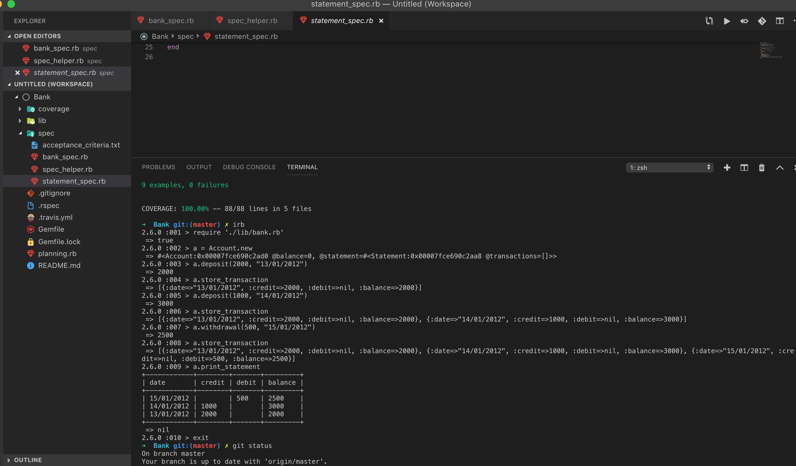

[](https://travis-ci.org/Brendao1/Bank-tech-test) [](https://codeclimate.com/github/Brendao1/Bank-tech-test/maintainability)


# Bank-tech-test

# How to interact with the program

Clone this repo and run bundle to install the gems: 

```
git clone git@github.com:Brendao1/Bank-tech-test.git

bundle
```
Launch irb in the console and require the program file:
```
irb

require './lib/bank.rb'
```
Here is an example interaction:

```
a = Account.new

a.deposit(1000, "10/01/2012")

a.store_transaction

a.deposit(2000, "13/01/2012")

a.store_transaction

a.withdrawal(500, "14/01/2012")

a.store_transaction

a.print_statement

=>
```
Provides the following output:
```

+------------+--------+-------+---------+
| date       | credit | debit | balance |
+------------+--------+-------+---------+
| 14/01/2012 |        | 500   | 2500    |
| 13/01/2012 | 2000   |       | 3000    |
| 10/01/2012 | 1000   |       | 1000    |
+------------+--------+-------+---------+
```

## Screenshot of app running in the terminal



## Approach

- I planned the domain using paper and pen, defining the methods
    Account class deals with making deposits and withdrawals
    Statement class stores the transactions and prints out the statement
    Bank class is the over-arching class which can in future hold more classes for added functionality
- I googled solutions for creating a table in the terminal and found Terminal Table gem
- I spiked some code and interacted with it using irb
- I decided on the MVP: 
    User can make deposits and withdrawals
    User can print a statement
    There are no restrictions/limits (so the account can be overdrawn)
- I wrote the tests and the methods, building iteratively
- After passing the basic acceptance tests, I added Code Climate, Test Coverage and Linting
